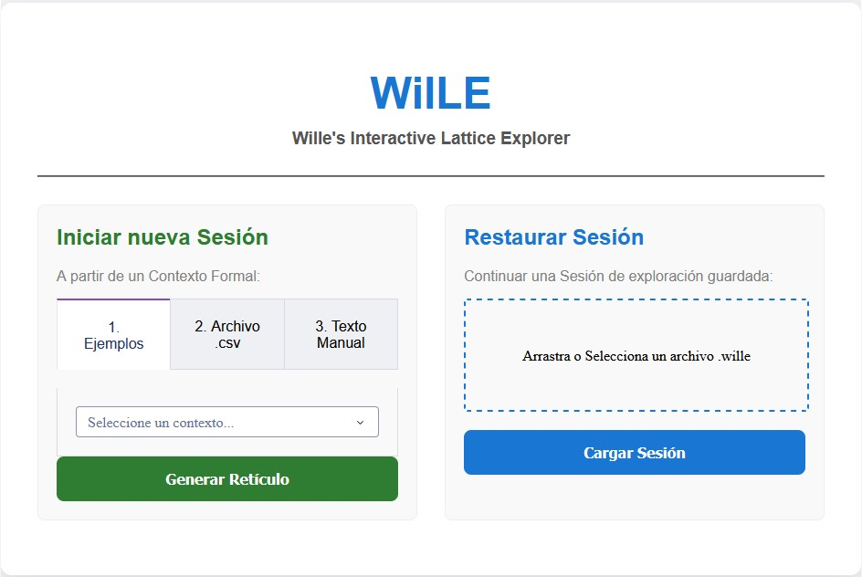
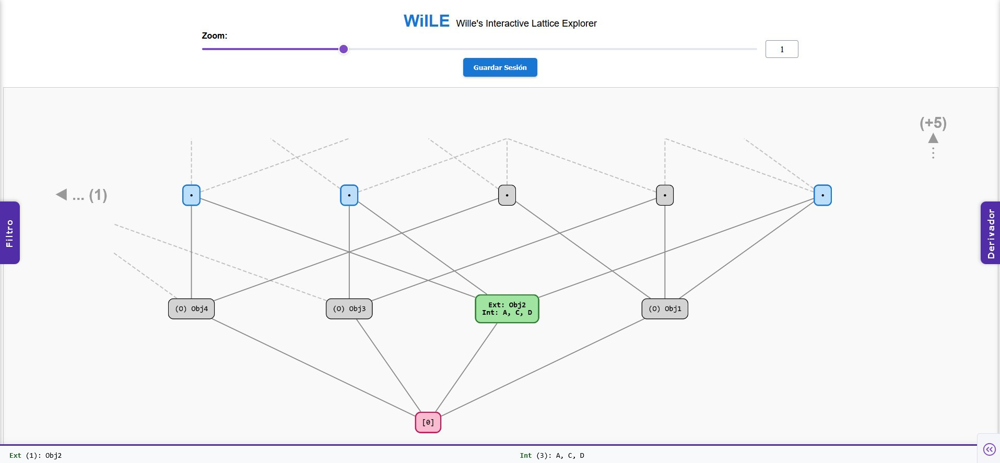
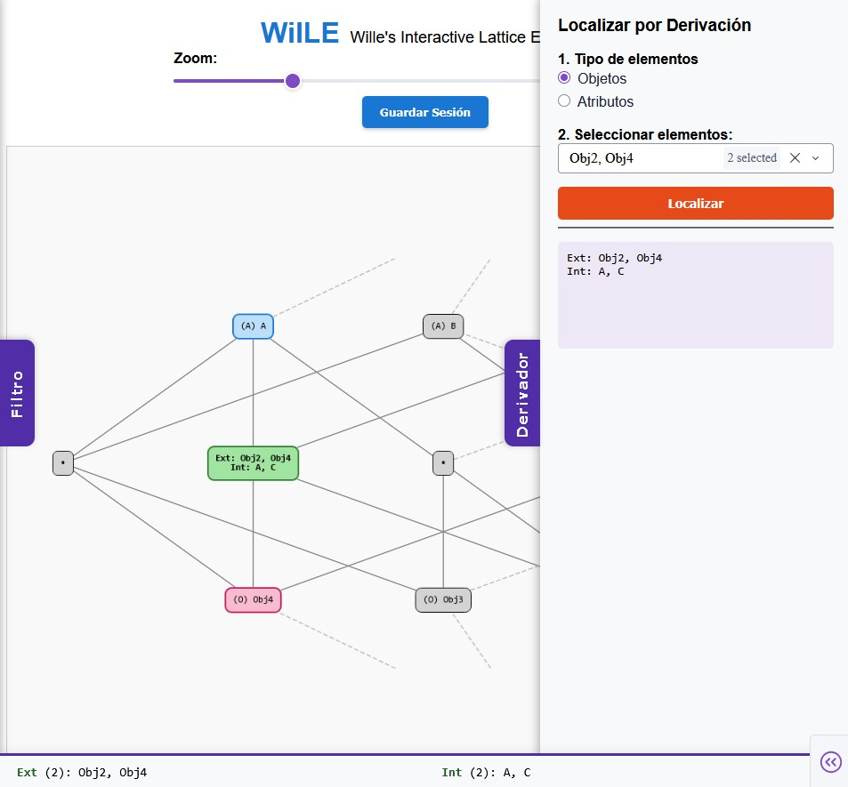
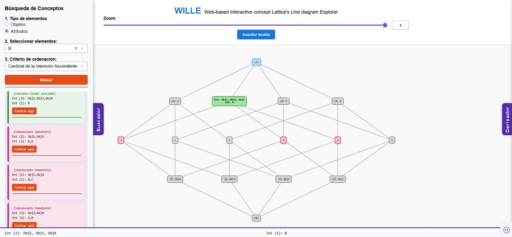

# WILLE (Web-based Interactive concept Lattice's Line diagram Explorer)

Bienvenido al repositorio oficial de **WILLE**, una aplicación web local e interactiva que versa sobre **Análisis de Conceptos Formales (ACF)**, desarrollada como Trabajo de Fin de Grado. 

Este proyecto nace con el objetivo de facilitar una herramienta interactiva que permita al usuario explorar visualmente el **Retículo de Conceptos** asociado a un **Contexto Formal** de forma dinámica y escalable. Construida íntegramente en Python utilizando el *framework* Dash y haciendo uso de la librería de ACF Concepts, la aplicación está diseñada para mitigar la sobrecarga cognitiva inherente a los retículos densos. Para ello, WILLE presenta un entorno de trabajo basado en vistas locales, que permite al usuario navegar a través del diagrama de Hasse correspondiente al retículo, por medio de la selección en tiempo real del nodo central de la vista (de forma manual, localizando por derivación, y realizando búsquedas asociadas a un subconjunto de objetos o atributos de interés) así como el ajuste del radio de amplitud visual (zoom) alrededor de dicho nodo. Por otro lado, WILLE soporta de forma nativa la persistencia de sesiones, permitiendo al usuario exportar la sesión de exploración en un archivo para posteriormente restaurar su estado.

---

# Guía de instalación y ejecución

**Requisitos previos:** Tener instalado el intérprete de Python 3.x en el sistema, así como disponer de un navegador web moderno (se ha verificado la compatibilidad de la aplicación en Google Chrome y Mozilla Firefox).

## Windows

1. Abrir una terminal en el directorio raíz del proyecto.
2. Crear un entorno virtual Python (venv): `python -m venv venv`
3. Activar el entorno virtual: `.\venv\Scripts\activate`
   
   **NOTA:**
   Si al intentar activar el entorno virtual de Python se produce un error en la consola indicando que "la ejecución de scripts está deshabilitada en este sistema", no se trata de un fallo de la aplicación, sino de una política de seguridad predeterminada de Windows PowerShell.

   Para solucionarlo y permitir que el entorno virtual se active correctamente, es necesario otorgar permisos de ejecución de scripts locales al usuario actual. Para ello, ejecute el siguiente comando en su terminal PowerShell (solo es necesario hacerlo una vez):

   `Set-ExecutionPolicy -ExecutionPolicy RemoteSigned -Scope CurrentUser`

   Al pulsar Enter, el sistema puede pedir una confirmación. Escriba S (o Y en sistemas en inglés) y pulse Enter. Tras esto, podrá activar el entorno virtual y retomar el proceso por el paso 3.
   
4. Instalar las dependencias necesarias: `pip install -r requirements.txt`
5. Ejecutar la aplicación: `python app.py` (y acceder desde su navegador web a la dirección local que proporcionará la consola, habitualmente `http://127.0.0.1:8050/`).
6. *Finalización:* Para detener la ejecución de WILLE, pulse `Ctrl + C` en la terminal y, a continuación, ejecute el comando `deactivate` para cerrar de forma segura el entorno virtual.

## Linux y MacOS

1. Abrir una terminal en el directorio raíz del proyecto.
2. Crear un entorno virtual Python (venv): `python3 -m venv venv`
3. Activar el entorno virtual: `source venv/bin/activate`
4. Instalar las dependencias necesarias: `pip install -r requirements.txt`
5. Ejecutar la aplicación: `python app.py` (y acceder desde su navegador web a la dirección local que proporcionará la consola, habitualmente `http://127.0.0.1:8050/`).
6. *Finalización:* Para detener la ejecución de WILLE, pulse `Ctrl + C` en la terminal y, a continuación, ejecute el comando `deactivate` para cerrar de forma segura el entorno virtual.

---

# Manual de Usuario

Suponiendo correctamente instaladas las dependencias necesarias, y ejecutada la aplicación, a continuación se detallan de forma ordenada las diferentes etapas que componen una sesión con la herramienta.

## Pantalla de Inicio

Al acceder a la aplicación, el sistema presenta una interfaz donde el usuario debe proporcionar el contexto formal de entrada para iniciar una nueva sesión, o restaurar una sesión previa en el estado en que la dejó (por medio de la selección de un archivo de entrada con extensión .wille). Ambas vías de acceso están visualmente separadas en forma de columnas disjuntas, y cada una dispone de un botón dedicado que, tras proporcionar la entrada, y si esta tiene el formato esperado, da paso al espacio principal de exploración.

En el primer caso (cargando un contexto formal), a su vez, se permite elegir el método de carga del contexto formal, de entre tres opciones (cada una asignada a una pestaña diferente en la columna izquierda), a saber:

1. **Ejemplos:** Permite seleccionar una serie de contextos formales de ejemplo, ya incluidos en la herramienta, para una evaluación rápida.
2. **Archivo .csv:** Permite arrastrar o seleccionar un archivo de extensión .csv, con el contexto formal en formato tabular.
3. **Texto manual:** Permite la introducción manual del contexto formal, en el mismo formato tabular que la opción anterior, en un área de texto plano dedicada.

Una vez introducidos los datos por el método escogido, al pulsar el botón correspondiente, se realizan los cálculos internos necesarios para generar (o cargar) toda la estructura de datos que engloba el estado inicial de la sesión, y se transiciona al entorno de navegación principal.

## Pantalla Principal de Exploración

Esta es la interfaz núcleo de la aplicación, en la que se permite navegar por la estructura del retículo de conceptos por medio de vistas locales de su diagrama de Hasse asociado.

En la figura siguiente se muestra la pantalla con una vista local centrada en el concepto formal de extensión {Obj2} e intensión {A, C, D}, sobre una sesión asociada al ejemplo precargado A.

El espacio central de la pantalla se divide en tres componentes fundamentales:

* **Cuadro superior:** Contiene el título, el control deslizante del nivel de Zoom a considerar en la vista local presentada (adaptando el radio de amplitud visual a conveniencia para mostrar más o menos nodos), así como un botón que permite exportar la sesión actual (permitiendo al usuario descargar desde el navegador un archivo .wille que encapsula el estado actual de la sesión, incluyendo la vista local que hubiera presente).
* **Lienzo interactivo:** La región que ocupa la mayor parte del espacio en pantalla, dedicada a mostrar la vista local del diagrama asociado al retículo de conceptos. El usuario puede interactuar directamente con este espacio para hacer clic sobre cualquier nodo y convertirlo en el nuevo centro de la vista, destacando visualmente dicho nodo en color verde, así como sus vecinos superiores (superconceptos inmediatos) en color cian, y sus vecinos inferiores (subconceptos inmediatos) en color magenta.
* **Panel Inferior de Inspección:** En la parte inferior de la pantalla se dispone de un cuadro de texto que muestra en tiempo real la Extensión (objetos) e Intensión (atributos) asociadas al Concepto formal seleccionado como nodo central de la vista en cada momento.

Así mismo, como se puede atisbar, se dispone de sendas pestañas laterales que actúan como conmutadores, desplegando/replegando los paneles "Derivador" y "Buscador", respectivamente. A continuación se pasa a detallar estos:

### Panel *Derivador* (Localizar mediante derivación)

Desplegable desde la pestaña derecha, este panel permite localizar rápidamente el concepto formal asociado a un subconjunto de objetos o atributos de interés para el usuario (conforme al método descrito en la proposición analítica correspondiente).

En la siguiente figura puede verse por ejemplo el resultado de localizar el concepto formal asociado a los objetos Obj2 y Obj4, para el ejemplo precargado A.

Dicho panel permite elegir si la consulta se basará en Objetos o Atributos, seleccionar los elementos deseados, y finalmente pulsando el botón "Localizar", se procede a calcular el concepto formal asociado a dicho subconjunto, recentrar la vista estableciendo este último como el nodo focal, así como mostrar la extensión e intensión del mismo en un cuadro de texto complementario al panel inferior (para una inspección más rápida de la información).

### Panel *Buscador* (Buscar conceptos formales)

Desplegable desde la pestaña izquierda, este panel permite hacer un cribado del total de conceptos formales, encontrando aquellos que contengan un determinado subconjunto de objetos o atributos de interés para el usuario, en su extensión o intensión, respectivamente. De forma complementaria, mediante este panel se puede consultar la lista de superconceptos o subconceptos directos asociados a uno conocido, realizando la búsqueda a partir de la extensión o intensión del mismo, respectivamente.

En la siguiente figura se muestran por ejemplo los resultados del búsqueda por el atributo *B*, así como la selección del primer resultado. Este caso ilustra a la perfección la funcionalidad previamente comentada: debido a que el subconjunto $\{B\}$ coincide con la intensión de un concepto formal existente, al hacer la búsqueda asociada, los resultados listados empiezan por dicho concepto formal, siguiendo a continuación por sus subconceptos inmediatos (que aparecen al mismo tiempo destacados visualmente en la propia vista del diagrama).

De forma similar al panel anterior, este también permite elegir si la consulta se basará en Objetos o Atributos, así como seleccionar los elementos deseados. Así mismo, ofrece la posibilidad de establecer el criterio de ordenación en que serán presentados los resultados (en orden ascendente o descendente del cardinal de la extensión o de la intensión del concepto, en función de si se consideró un subconjunto de objetos o atributos, respectivamente). Finalmente, tras pulsar el botón "Buscar", se obtienen los resultados de dicha búsqueda, no presentándose más de $50$ resultados por cuestiones de legibilidad, y por cuestiones de rendimiento, el tiempo de respuesta en cualquier caso tampoco excederá los $4s$.